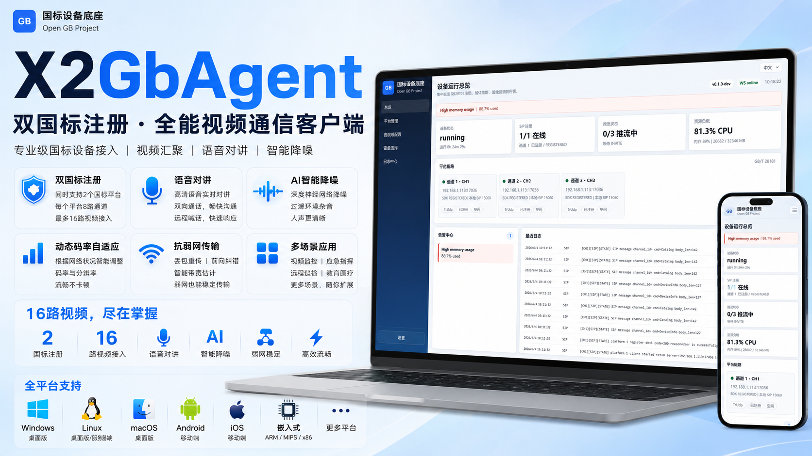

# X2GbAgent

<p align="center">
  
</p>

<p align="center">
  <a href="#中文">中文</a> | <a href="#english">English</a>
</p>

<p align="center">
  
  
  
  
</p>

## 中文

X2GbAgent 是一个面向边缘设备和嵌入式场景的 GB/T 28181 设备接入 Agent。它把 SIP 注册、媒体采集、编码推流、Web 控制台、配置存储和运行观测整合到一个轻量级 C/C++ 工程中，适合做国标视频网关、设备模拟器、边缘接入节点和硬件 SDK 适配层。

### 核心能力

- **GB28181 接入**：集成 X2/cGb28181 SDK，可对接真实 SIP 平台，支持多平台与多通道配置。
- **多输入源**：支持摄像头/麦克风采集、媒体文件模拟输入、桌面屏幕输入，以及 DV500 硬件媒体后端。
- **媒体链路**：基于 FFmpeg 的采集、解码、编码和 JPEG 预览能力；嵌入式目标可切换到硬件 VI/VPSS/VENC。
- **Web 控制台**：内置 Mongoose HTTP 服务，提供登录、平台管理、音视频配置、设备选择、日志、系统设置和 WebSocket 状态推送。
- **本地持久化**：内置 SQLite，用于保存平台、通道、设备源、认证与日志配置。
- **可测试性**：包含原生媒体 smoke tests、HTTP/API 韧性测试、WebSocket 状态测试、输入源切换和重启恢复测试。

### 目录结构

```text
.
├── CMakeLists.txt
├── include/                 # Public media interfaces
├── src/                     # Agent, web API, media pipeline and platform code
├── web_root/                # Built-in Web console
├── tests/                   # Smoke, reliability and demo tests
├── third_party/             # Embedded third-party sources
├── thrid_lib/               # FFmpeg and cGb28181 SDK packages
├── data/                    # Install SQL and sample media
└── images/                  # README and marketing assets
```

### 快速开始

> 所有 CMake 构建产物必须放在 `build-cmake/<platform>-<arch>` 下。不要在源码目录、`build/`、`out/`、`x64/`、`Debug/`、`Release/` 或 `cmake-build-debug/` 中生成构建文件。

#### Windows x64 / Visual Studio

```bat
cmake -S . -B build-cmake/win-x64 -G "Visual Studio 17 2022" -A x64
cmake --build build-cmake/win-x64 --config Release
```

运行：

```bat
build-cmake\win-x64\bin\Release\gb28181-agent.exe http://0.0.0.0:8000 gb28181-agent.db web_root
```

#### Windows x64 / Ninja

```bat
cmake -S . -B build-cmake/win-x64 -G Ninja -DCMAKE_BUILD_TYPE=Release
cmake --build build-cmake/win-x64
```

#### Linux x64

```bash
cmake -S . -B build-cmake/linux-x64 -DCMAKE_BUILD_TYPE=Release
cmake --build build-cmake/linux-x64 -j
```

#### DV500 / Embedded Linux

```bash
cmake -S . -B build-cmake/linux-arm64 \
  -DCMAKE_TOOLCHAIN_FILE=cmake/toolchains/linux-arm64.cmake \
  -DGBMEDIA_PLATFORM_PROFILE=dv500 \
  -DGBMEDIA_DV500_SDK_ROOT=/path/to/dv500/sdk \
  -DGBMEDIA_FFMPEG_TARGET_LIB_DIR=/path/to/target/ffmpeg/lib \
  -DCMAKE_BUILD_TYPE=Release

cmake --build build-cmake/linux-arm64 -j
```

### 运行与登录

默认监听地址为 `http://0.0.0.0:8000`，启动后访问：

```text
http://127.0.0.1:8000
```

默认账号：

```text
Username: admin
Password: anyrtc
```

命令行参数：

```text
gb28181-agent [listen_url] [db_path] [web_root] [log_dir] [log_max_bytes] [log_rotate_count]
```

日志也可通过环境变量配置：

```text
GB_AGENT_LOG_DIR
GB_AGENT_LOG_MAX_BYTES
GB_AGENT_LOG_ROTATE_COUNT
```

### 常用 CMake 选项

| Option | Default | Description |
| --- | --- | --- |
| `GB_AGENT_BUILD_AGENT` | `ON` | Build the `gb28181-agent` executable. |
| `GB_AGENT_USE_X2_GBSDK` | `ON` | Enable X2/cGb28181 SDK integration for real SIP clients. |
| `GBMEDIA_USE_FFMPEG` | `ON` | Enable FFmpeg-backed capture, codec, file source and preview support. |
| `GBMEDIA_BUILD_TESTS` | `OFF` | Build native media smoke tests. |
| `GBMEDIA_PLATFORM_PROFILE` | `generic` | Target profile: `generic` or `dv500`. |
| `GBMEDIA_HARDWARE_BACKEND` | `none` | Hardware media backend: `none` or `dv500`. |
| `GB_AGENT_PREVIEW_FPS` | `5` | JPEG preview frame rate. |

### 测试

构建测试目标：

```bat
cmake -S . -B build-cmake/win-x64 -G "Visual Studio 17 2022" -A x64 -DGBMEDIA_BUILD_TESTS=ON
cmake --build build-cmake/win-x64 --config Release
```

运行可靠性测试套件：

```powershell
powershell -NoProfile -ExecutionPolicy Bypass -File tests\run_reliability_suite.ps1 -Config Release
```

### 许可证

X2GbAgent 使用 [MIT License](LICENSE) 发布。第三方组件遵循其各自许可证。

## English

X2GbAgent is a lightweight GB/T 28181 device access agent for edge and embedded deployments. It combines SIP registration, media capture, encoding, streaming, Web-based operations, local configuration storage, and runtime observability in a compact C/C++ codebase.

### Highlights

- **GB28181 connectivity**: integrates the X2/cGb28181 SDK for real SIP platform access, with multi-platform and multi-channel configuration.
- **Flexible input sources**: supports camera/microphone capture, media-file simulation, desktop screen input, and DV500 hardware media adapters.
- **Media pipeline**: FFmpeg-backed capture, decode, encode, file source, and JPEG preview; embedded targets can use hardware VI/VPSS/VENC paths.
- **Web console**: built-in Mongoose HTTP service with authentication, platform management, A/V configuration, device selection, logs, system settings, and WebSocket status updates.
- **Local persistence**: embedded SQLite stores platform, channel, input source, authentication, and log configuration.
- **Operational testing**: includes native media smoke tests, HTTP/API resilience tests, WebSocket status tests, input switching tests, and restart recovery checks.

### Quick Start

All CMake output must stay under `build-cmake/<platform>-<arch>`.

```bat
cmake -S . -B build-cmake/win-x64 -G "Visual Studio 17 2022" -A x64
cmake --build build-cmake/win-x64 --config Release
build-cmake\win-x64\bin\Release\gb28181-agent.exe http://0.0.0.0:8000 gb28181-agent.db web_root
```

Open `http://127.0.0.1:8000` and sign in with:

```text
Username: admin
Password: anyrtc
```

### Build Layout

Use these build directories consistently:

| Platform | Directory |
| --- | --- |
| Windows x64 | `build-cmake/win-x64` |
| Windows x86 | `build-cmake/win-x86` |
| Linux x64 | `build-cmake/linux-x64` |
| Linux arm64 | `build-cmake/linux-arm64` |
| macOS x64 | `build-cmake/macos-x64` |
| macOS arm64 | `build-cmake/macos-arm64` |

Never generate CMake artifacts in the source tree, `build/`, `out/`, `x64/`, `Debug/`, `Release/`, or `cmake-build-debug/`.

### License

X2GbAgent is released under the [MIT License](LICENSE). Third-party dependencies remain under their respective licenses.
